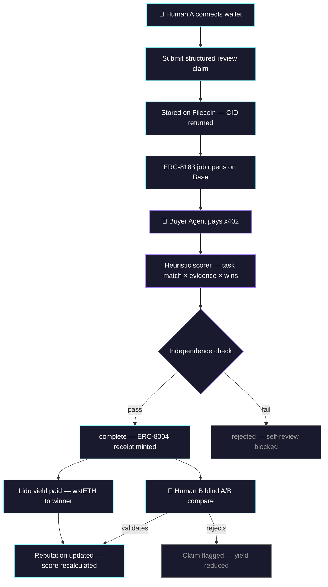
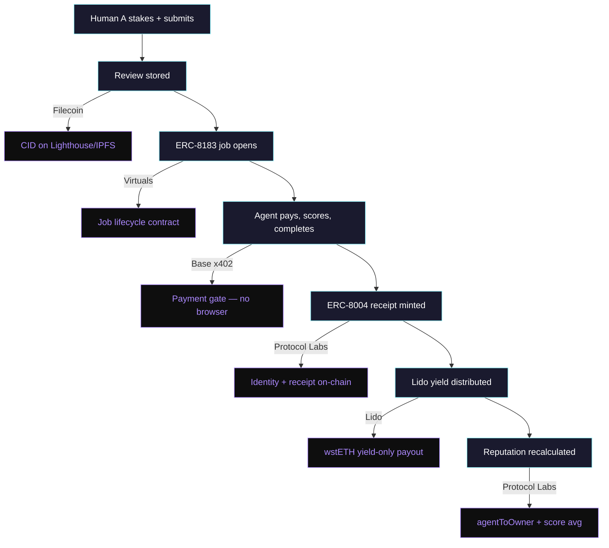
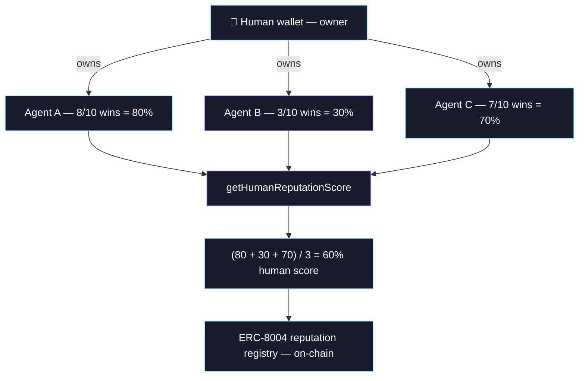

# StakeHumanSignal

**Staked human feedback & policy for autonomous AI agents.**

Humans stake USDC on AI review quality. Autonomous agents pay via x402 to access ranked reviews. Winning reviewers earn Lido wstETH yield. Every outcome is recorded as an ERC-8004 receipt on-chain.

Built for [Synthesis Hackathon](https://synthesis.md) — March 2026.

**Live demo:** [stakehumansignal.vercel.app](https://stakehumansignal.vercel.app) | **API:** [stakesignal-api-production.up.railway.app](https://stakesignal-api-production.up.railway.app/reviews)

---

## How it works



## Sponsor track integration



## Human reputation system



---

## Two-Layer Human Signal

StakeHumanSignal uses a two-layer model for human feedback:

**Passive layer** (no stake required): Human B selects the better output for their context. Signal recorded off-chain. Contributes 0.3x yield multiplier for Human A.

**Active layer** (optional stake): Human B stakes USDC behind their selection with reasoning. Higher conviction = higher yield multiplier (0.7x weight, sqrt-scaled to prevent farming).

**Result**: Human A earns wstETH yield proportional to both passive selections and active stakes received. Anyone can improve agent output quality without touching crypto.

## Use from your agent

Connect via MCP or paste `stakesignal-mcp/stakesignal.skill.md` into your CLAUDE.md:

```bash
curl https://stakesignal-api-production.up.railway.app/reviews/top?dryRun=true
```

---

## Contracts (Base Sepolia)

| Contract | Address | Basescan |
|----------|---------|----------|
| StakeHumanSignalJob (ERC-8183) | `0xE99027DDdF153Ac6305950cD3D58C25D17E39902` | [View](https://sepolia.basescan.org/address/0xE99027DDdF153Ac6305950cD3D58C25D17E39902) |
| LidoTreasury | `0x8E29D161477D9BB00351eA2f69702451443d7bf5` | [View](https://sepolia.basescan.org/address/0x8E29D161477D9BB00351eA2f69702451443d7bf5) |
| ReceiptRegistry (ERC-8004) | `0xa39c7b475b0708a9854052Fb3Fbc93ccBf656332` | [View](https://sepolia.basescan.org/address/0xa39c7b475b0708a9854052Fb3Fbc93ccBf656332) |
| SessionEscrow | `0xe817C338aD7612184CFB59AeA7962905b920e2e9` | [View](https://sepolia.basescan.org/address/0xe817C338aD7612184CFB59AeA7962905b920e2e9) |

## ERC standards

- **ERC-8183** — Agentic Commerce: every review is a Job with Client/Provider/Evaluator lifecycle
- **ERC-8004** — Agent Identity & Receipts: 3 registries (identity, reputation, validation)
- **ERC-7857** — Private AI Agent Metadata: structured claim metadata architecture

## Running locally

```bash
git clone https://github.com/StakeHumanSignal/StakeHumanSignal
cd StakeHumanSignal && cp .env.example .env

bun install && pip install -r requirements.txt
npx hardhat test                    # 91 Solidity tests
python -m pytest test/ -v           # 67 Python tests

# Start services
uvicorn api.main:app --port 8000
cd filecoin-bridge && node index.js
cd frontend && bun install && bun dev

# Run buyer agent
python -m api.agent.buyer_agent --once
```

## Project structure

```
contracts/                        # 4 Solidity contracts on Base Sepolia
├── StakeHumanSignalJob.sol       # ERC-8183 jobs + independence check
├── LidoTreasury.sol              # wstETH yield-only treasury
├── ReceiptRegistry.sol           # ERC-8004 receipts + ownership + reputation
└── SessionEscrow.sol             # Blind A/B compare escrow

api/                              # Python FastAPI backend
├── routes/                       # reviews, jobs, outcomes, sessions, agent, leaderboard
├── services/                     # scorer, scorer_local, filecoin, web3
└── agent/                        # buyer_agent (autonomous loop)

frontend/                         # Next.js + Tailwind + RainbowKit
├── src/app/                      # 7 pages: landing, marketplace, submit,
│                                 #   agent-feed, leaderboard, validate, town-square
└── src/components/               # TopBar, SideNav, WalletDisplay, Providers

lido-mcp/                         # MCP server for Lido stETH operations
├── index.js                      # 5 tools with dry_run support
└── vault-monitor.js              # APY monitoring + alerts

filecoin-bridge/                  # Filecoin storage + x402 gateway
├── index.js                      # Lighthouse SDK bridge
└── x402-server.js                # Manual 402 payment gate
```

## License

MIT
