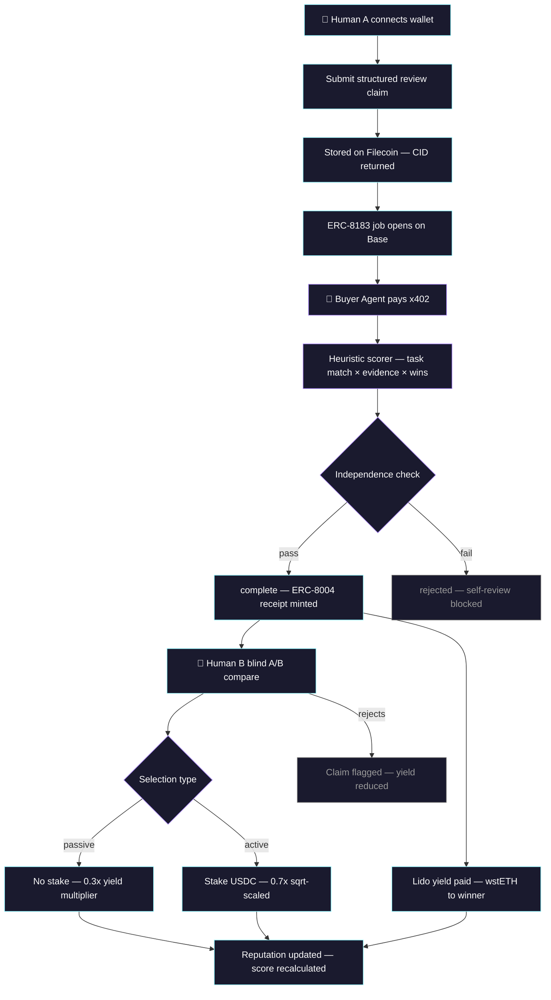
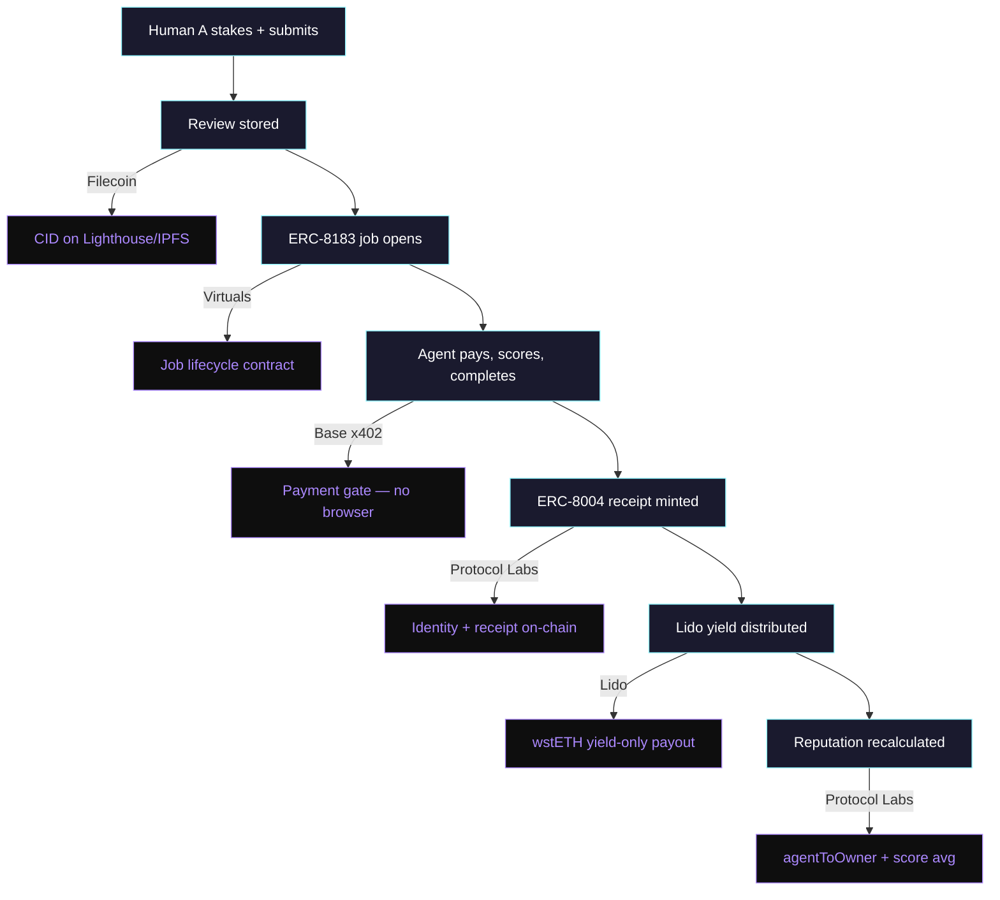
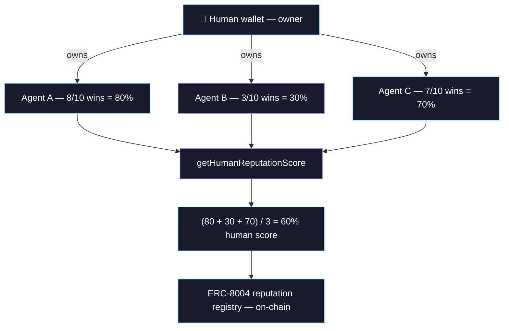

# StakeHumanSignal

**Staked human feedback & policy for autonomous AI agents.**

Humans stake USDC on AI review quality. Autonomous agents pay via x402 to access ranked reviews. Winning reviewers earn Lido wstETH yield. Every outcome is recorded as an ERC-8004 receipt on-chain.

Built for [Synthesis Hackathon](https://synthesis.md) — March 2026.

**Live demo:** [stakehumansignal.vercel.app](https://stakehumansignal.vercel.app) | **API:** [stakesignal-api-production.up.railway.app](https://stakesignal-api-production.up.railway.app/reviews)

---

# StakeHumanSignal

StakeHumanSignal is a policy ranking and validation layer for AI agents.

As agents gain the ability to choose APIs, models, prompts, tools, and execution strategies on behalf of users, the most important problem is no longer just generation. It is selection.

The hard question is:

**Which policy is most likely to work for this user, for this task, under these constraints?**

Today, agents can execute tools, but they still lack a trustworthy way to learn from prior human judgment about what actually works in practice. Valuable human preference is constantly produced during real usage, but it usually disappears inside isolated sessions, private workflows, or unstructured reviews. It does not become reusable infrastructure that other agents can rely on.

StakeHumanSignal turns that missing judgment into a reusable layer.

Policy creators stake their policies in advance. A policy here means the execution logic behind an output: for example, a specific API, model, prompt, tool, or bundle of these choices. When a buyer agent receives a task from a user, it retrieves relevant policies, generates candidate outputs under different policies, and lets the user simply choose the better result in their own context.

That first interaction is intentionally lightweight. The user does not need to stake, write a formal review, or understand crypto mechanics just to benefit from the system. They only need to pick the better output.

If the user prefers the output generated under a given policy, the staker behind that policy earns higher yield. Then, if the user becomes convinced that the winning policy would also help others with similar intent or objectives, they can optionally inspect that policy, attach reasoning and context, and stake on it themselves. As more users validate and stake on a policy, that policy rises in rank and becomes more likely to be selected by future AI agents.

This creates a system with two layers:

* a **passive selection layer**, where ordinary users improve their own outcomes just by choosing the better output
* an **active validation layer**, where high-conviction users can reinforce broadly useful policies through optional staking and contextual reasoning

That separation is what makes the product both usable and defensible. Most systems fail because they ask users to do too much before any value is delivered. StakeHumanSignal reverses that order: it delivers immediate value first through better output selection, then allows stronger signals to accumulate only when users already have conviction.

Over time, this turns isolated output preferences into a compounding policy intelligence layer for agents.

## What it does and why it matters

StakeHumanSignal helps AI agents choose better policies by learning from real human preference.

Instead of relying on generic benchmarks, provider marketing, or static leaderboards, the system uses actual user choices made in real task contexts. A buyer agent retrieves the most relevant policies for a task, runs competing outputs, and lets the user decide which result is better. That decision improves ranking immediately. When users go one step further and actively stake behind a policy, the signal becomes even stronger.

This matters because the AI ecosystem is entering a new phase.

There are already many powerful models, APIs, and tools. The bottleneck is no longer access. The bottleneck is knowing which one to use, for whom, and when.

A policy that performs well in one setting may fail in another depending on the user’s intent, quality bar, domain, latency tolerance, cost sensitivity, or acceptable level of error. In practice, there is rarely a single globally best model or API. There are only policies that are better for specific slices of demand.

Without a decision layer that captures this, every agent keeps re-learning the same expensive lesson independently. Users pay for the wrong tool choices. Useful policies remain under-discovered. High-quality human judgment stays trapped inside one-off interactions.

StakeHumanSignal makes that judgment reusable.

It gives agents a way to benefit from prior human selection without requiring every user to become a professional evaluator. It also creates economic incentives for people who discover policies that are genuinely useful to others. That turns policy discovery from a hidden internal cost into a shared market of validated signals.

In short, StakeHumanSignal matters because the next critical layer in AI is not raw generation power. It is trusted policy selection.

## The specific problem being solved

The specific problem is the lack of a trustworthy, scalable way to determine which policy works best for which type of user and task.

Today, the same API or prompt bundle can produce dramatically different results depending on context:

* what the user is actually trying to achieve
* how much quality matters relative to speed
* whether cost is tightly constrained
* whether the task is factual, creative, strategic, or operational
* what kinds of mistakes are acceptable
* what output style the user prefers

But the systems used to choose between policies are still broken.

On one side, the ecosystem has low-friction signals such as clicks, usage volume, or general engagement. These scale easily, but they are too weak. They do not tell an agent whether a policy was actually better for a particular kind of user in a particular kind of situation.

On the other side, there are high-quality signals such as structured evaluations, explicit reviews, and expert judgments. These can be extremely valuable, but they are too expensive and too high-friction to collect at scale. If every user must actively review, explain, and stake before the system becomes useful, adoption collapses.

This is why the problem has remained unsolved.

The market has been stuck between two bad extremes:

* passive signals that scale but are too noisy
* active validation that is high-quality but too demanding

StakeHumanSignal solves this by separating ordinary usage from high-conviction participation.

At the passive layer, users simply choose the better output. That is enough to improve the system and reward the policy that created the preferred result. No staking is required.

At the active layer, users who gain conviction can inspect the winning policy, attach their own reasoning and environmental context, and optionally stake on it. That stronger signal helps the system identify policies that are not only good for one user once, but likely valuable for similar users and similar intents again.

This is the critical design choice.

It keeps the barrier to usage low enough for real adoption, while still allowing stronger and more durable signals to emerge over time. Instead of forcing every user to behave like a reviewer or trader, the system lets most users remain simple selectors and only invites deeper participation when conviction naturally exists.

The result is a policy-ranking system that can actually scale:

* easy enough for ordinary users to use
* strong enough for agents to rely on
* incentive-aligned enough for useful signals to compound

The core problem we solve is therefore:

**how to turn ordinary human output selection into a scalable, trustworthy policy-ranking layer for AI agents, without requiring every user to actively review or stake from the start.**

---

## How it works



## Sponsor track integration



## Human reputation system



---

## Two-Layer Human Signal

StakeHumanSignal uses a two-layer model for human feedback:

**Passive layer** (no stake required): Human B selects the better output for their context. Signal recorded off-chain. Contributes 0.3x yield multiplier for Human A.

**Active layer** (optional stake): Human B stakes USDC behind their selection with reasoning. Higher conviction = higher yield multiplier (0.7x weight, sqrt-scaled to prevent farming).

**Result**: Human A earns wstETH yield proportional to both passive selections and active stakes received. Anyone can improve agent output quality without touching crypto.

## Use from your agent

Connect via MCP or paste `stakesignal-mcp/stakesignal.skill.md` into your CLAUDE.md:

```bash
curl https://stakesignal-api-production.up.railway.app/reviews/top?dryRun=true
```

---

## Contracts (Base Sepolia)

| Contract | Address | Basescan |
|----------|---------|----------|
| StakeHumanSignalJob (ERC-8183) | `0xE99027DDdF153Ac6305950cD3D58C25D17E39902` | [View](https://sepolia.basescan.org/address/0xE99027DDdF153Ac6305950cD3D58C25D17E39902) |
| LidoTreasury | `0x8E29D161477D9BB00351eA2f69702451443d7bf5` | [View](https://sepolia.basescan.org/address/0x8E29D161477D9BB00351eA2f69702451443d7bf5) |
| ReceiptRegistry (ERC-8004) | `0xa39c7b475b0708a9854052Fb3Fbc93ccBf656332` | [View](https://sepolia.basescan.org/address/0xa39c7b475b0708a9854052Fb3Fbc93ccBf656332) |
| SessionEscrow | `0xe817C338aD7612184CFB59AeA7962905b920e2e9` | [View](https://sepolia.basescan.org/address/0xe817C338aD7612184CFB59AeA7962905b920e2e9) |

## ERC standards

- **ERC-8183** — Agentic Commerce: every review is a Job with Client/Provider/Evaluator lifecycle
- **ERC-8004** — Agent Identity & Receipts: 3 registries (identity, reputation, validation)
- **ERC-7857** — Private AI Agent Metadata: structured claim metadata architecture

## Running locally

```bash
git clone https://github.com/StakeHumanSignal/StakeHumanSignal
cd StakeHumanSignal && cp .env.example .env

bun install && pip install -r requirements.txt
npx hardhat test                    # 91 Solidity tests
python -m pytest test/ -v           # 71 Python tests

# Start services
uvicorn api.main:app --port 8000
cd filecoin-bridge && node index.js
cd frontend && bun install && bun dev

# Run buyer agent
python -m api.agent.buyer_agent --once
```

## Project structure

```
contracts/                        # 4 Solidity contracts on Base Sepolia
├── StakeHumanSignalJob.sol       # ERC-8183 jobs + independence check
├── LidoTreasury.sol              # wstETH yield-only treasury
├── ReceiptRegistry.sol           # ERC-8004 receipts + ownership + reputation
└── SessionEscrow.sol             # Blind A/B compare escrow

api/                              # Python FastAPI backend
├── routes/                       # reviews, jobs, outcomes, sessions, agent, leaderboard
├── services/                     # scorer, scorer_local, filecoin, web3
└── agent/                        # buyer_agent (autonomous loop)

frontend/                         # Next.js + Tailwind + RainbowKit
├── src/app/                      # 7 pages: landing, marketplace, submit,
│                                 #   agent-feed, leaderboard, validate, town-square
└── src/components/               # TopBar, SideNav, WalletDisplay, Providers

lido-mcp/                         # MCP server for Lido stETH operations
├── index.js                      # 9 tools with dry_run support
└── vault-monitor.js              # APY monitoring + alerts

stakesignal-mcp/                  # MCP server for StakeHumanSignal operations
└── index.js                      # 5 tools (get_ranked, submit_passive, stake_on, etc.)

filecoin-bridge/                  # Filecoin storage + x402 gateway
├── index.js                      # Lighthouse SDK bridge
└── x402-server.js                # Manual 402 payment gate
```

## License

MIT
