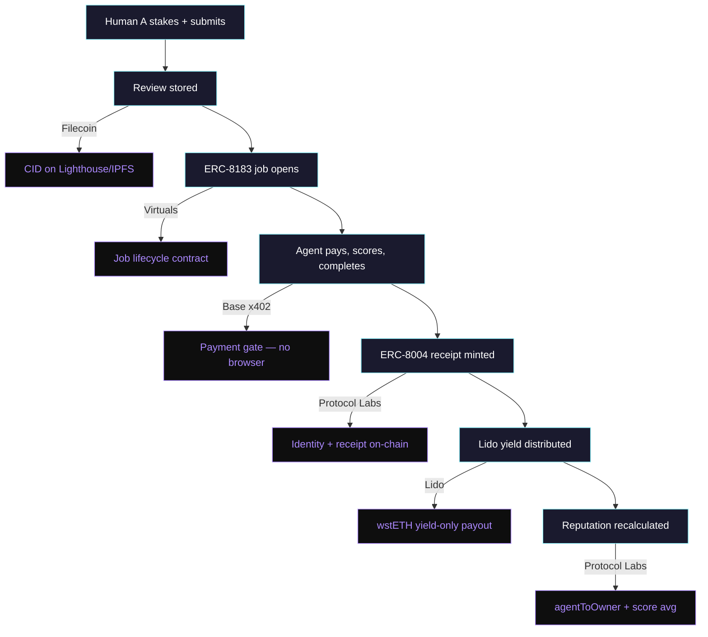
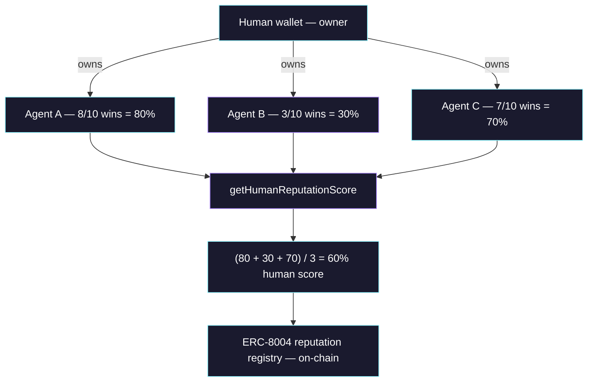

# StakeHumanSignal

**A staked human feedback marketplace where humans bet real money on AI evaluation quality, agents pay to access trusted verdicts, and winners earn yield.**

**Live demo:** [stakehumansignal.vercel.app](https://stakehumansignal.vercel.app) | **API:** [stakesignal-api-production.up.railway.app](https://stakesignal-api-production.up.railway.app/reviews) | Built for [Synthesis Hackathon](https://synthesis.md) — March 2026

---

## Problem Statement

<!-- Submission field: problemStatement -->

AI agents can now execute tools, call APIs, and choose between models — but they have no trustworthy way to learn which option actually works for a given user and task. The same API or prompt produces dramatically different results depending on context: what the user is trying to achieve, their quality bar, cost sensitivity, and acceptable error rate.

The current ecosystem is stuck between two extremes. Passive signals (clicks, usage volume) scale but are too noisy — they don't tell an agent whether a policy was actually better for a specific situation. Active evaluation (structured reviews, expert judgments) is high-quality but too expensive to collect at scale — if every user must formally review before the system works, adoption collapses.

The result: every agent independently re-learns the same expensive lessons. Useful human judgment stays trapped inside one-off interactions. There is no shared, incentive-aligned infrastructure for agents to learn from prior human preference about what actually works in practice.

## What StakeHumanSignal Does

<!-- Submission field: description -->

StakeHumanSignal turns human preference into a reusable policy-ranking layer for AI agents. Humans compare two AI outputs side by side and pick the winner. If they have conviction, they stake real USDC on their choice. AI buyer agents pay via x402 micropayments to access these ranked, staked verdicts — because skin in the game means signal they can trust. Winners earn Lido wstETH yield. Every outcome is permanently recorded as an ERC-8004 receipt on Base and stored on Filecoin.

The system works through two layers:

* **Passive layer** — users simply pick the better output in a blind A/B comparison. No stake required. Contributes a 0.3x yield multiplier. This keeps the barrier low enough for real adoption.
* **Active layer** — high-conviction users stake USDC behind their selection with reasoning. 0.7x weight, sqrt-scaled to prevent whale farming. This produces the durable signal agents can rely on.

Over time, isolated human preferences compound into a shared intelligence layer that makes every agent's policy selection better.

### What is actually built and deployed

| Layer | Implementation | Status |
|-------|---------------|--------|
| Policy staking | `StakeHumanSignalJob.sol` — ERC-8183 job lifecycle on Base Sepolia | Deployed |
| Blind A/B compare | `SessionEscrow.sol` + `/validate` page | Deployed |
| Passive selection | `POST /sessions/{id}/settle` — no-stake preference recording | Live |
| Active staking | `POST /reviews` with `stake_amount` + `stake_tx_hash` | Live |
| x402 agent payments | x402 gate on `/reviews/top` (0.001 USDC, Base Sepolia) | Live |
| On-chain receipts | `ReceiptRegistry.sol` — ERC-8004 with 3 registries (identity, reputation, validation) | Deployed |
| Yield distribution | `LidoTreasury.sol` — wstETH principal locked, yield-only payouts | Deployed |
| Permanent storage | `filecoin-bridge/` — every review stored with Filecoin CID | Live |
| Autonomous agent | `buyer_agent.py` — fetch, score, independence check, complete, mint, distribute | 123+ log entries |
| MCP integration | `lido-mcp/` (9 tools) + `stakesignal-mcp/` (5 tools) | Live |
| Frontend | 7-page Next.js dashboard with wallet connect, live feed, leaderboard | [Live](https://stakehumansignal.vercel.app) |

---

## How it works


## Sponsor track integration



## Human reputation system



---

## For Judges — Track Navigation

Each track maps to specific folders. Click through for architecture, deployed addresses, and test instructions.

| Track | Sponsor | Prize | Start Here |
|-------|---------|-------|------------|
| ERC-8183 Open Build | Virtuals | $2,000 | [`contracts/`](contracts/) — `StakeHumanSignalJob.sol` |
| Agents With Receipts (ERC-8004) | Protocol Labs | $4,000 | [`contracts/`](contracts/) — `ReceiptRegistry.sol` (3 registries) |
| Let the Agent Cook | Protocol Labs | $4,000 | [`api/`](api/) — `agent/buyer_agent.py` + [`agent_log.json`](agent_log.json) |
| stETH Agent Treasury | Lido | $3,000 | [`contracts/`](contracts/) — `LidoTreasury.sol` + [`lido-mcp/`](lido-mcp/) |
| Lido MCP Server | Lido | $5,000 | [`lido-mcp/`](lido-mcp/) — 9 tools, dry_run, Sepolia contracts |
| Mechanism Design | Octant | $1,000 | [`api/`](api/) — conviction-weighted staking + scorer |
| Data Collection | Octant | $1,000 | [`api/`](api/) — autonomous review collection + Filecoin |
| Agentic Storage | Filecoin | $2,000 | [`filecoin-bridge/`](filecoin-bridge/) — Lighthouse SDK bridge |
| Open Track | Synthesis | $28,000+ | Full repo — [`frontend/`](frontend/) for live demo |

---

## Contracts (Base Sepolia)

| Contract | Address | Basescan |
|----------|---------|----------|
| StakeHumanSignalJob (ERC-8183) | `0xE99027DDdF153Ac6305950cD3D58C25D17E39902` | [View](https://sepolia.basescan.org/address/0xE99027DDdF153Ac6305950cD3D58C25D17E39902) |
| LidoTreasury | `0x8E29D161477D9BB00351eA2f69702451443d7bf5` | [View](https://sepolia.basescan.org/address/0x8E29D161477D9BB00351eA2f69702451443d7bf5) |
| ReceiptRegistry (ERC-8004) | `0xa39c7b475b0708a9854052Fb3Fbc93ccBf656332` | [View](https://sepolia.basescan.org/address/0xa39c7b475b0708a9854052Fb3Fbc93ccBf656332) |
| SessionEscrow | `0xe817C338aD7612184CFB59AeA7962905b920e2e9` | [View](https://sepolia.basescan.org/address/0xe817C338aD7612184CFB59AeA7962905b920e2e9) |

## ERC standards

- **ERC-8183** — Agentic Commerce: every review is a Job with Client/Provider/Evaluator lifecycle
- **ERC-8004** — Agent Identity & Receipts: 3 registries (identity, reputation, validation)
- **ERC-7857** — Private AI Agent Metadata: structured claim metadata architecture

## Use from your agent

Connect via MCP or paste `stakesignal-mcp/stakesignal.skill.md` into your CLAUDE.md:

```bash
curl https://stakesignal-api-production.up.railway.app/reviews/top?dryRun=true
```

## Running locally

```bash
git clone https://github.com/StakeHumanSignal/StakeHumanSignal
cd StakeHumanSignal && cp .env.example .env

bun install && pip install -r requirements.txt
npx hardhat test                    # 91 Solidity tests
python -m pytest test/ -v           # 71 Python tests
cd frontend && bun install && bun run test  # 5 nav consistency tests

# Start services
uvicorn api.main:app --port 8000
cd filecoin-bridge && node index.js
cd frontend && bun dev

# Run buyer agent
python -m api.agent.buyer_agent --once
```

## Project structure

```
contracts/                        # 4 Solidity contracts on Base Sepolia
├── StakeHumanSignalJob.sol       # ERC-8183 jobs + independence check
├── LidoTreasury.sol              # wstETH yield-only treasury
├── ReceiptRegistry.sol           # ERC-8004 receipts + ownership + reputation
└── SessionEscrow.sol             # Blind A/B compare escrow

api/                              # Python FastAPI backend
├── routes/                       # reviews, jobs, outcomes, sessions, agent, leaderboard
├── services/                     # scorer, scorer_local, filecoin, web3
└── agent/                        # buyer_agent (autonomous loop)

frontend/                         # Next.js 16 + Tailwind 4 + RainbowKit
├── src/app/                      # 7 pages: landing, marketplace, submit,
│                                 #   agent-feed, leaderboard, validate, town-square
└── src/components/               # TopBar, SideNav, WalletDisplay, Providers

lido-mcp/                         # MCP server for Lido stETH operations
├── index.js                      # 9 tools with dry_run support
└── vault-monitor.js              # APY monitoring + alerts

stakesignal-mcp/                  # MCP server for StakeHumanSignal operations
└── index.js                      # 5 tools (get_ranked, submit_passive, stake_on, etc.)

filecoin-bridge/                  # Filecoin storage bridge
└── index.js                      # Synapse SDK + local CID fallback

agent/                            # Agent configuration & skill docs
├── skills/                       # Project-specific agent skill files (.md)
└── CLAUDE.md                     # Agent instructions

skills/                           # Claude Code plugin skills (gstack ecosystem)
└── */                            # Installed skill plugins
```

## Test coverage

| Suite | Tests | Covers |
|-------|-------|--------|
| Solidity (Hardhat) | 91 passing | Job lifecycle, receipts, treasury, escrow, independence checks |
| Python (pytest) | 71 passing | Scorer, schema validation, task intent, two-layer payout |
| Frontend (vitest) | 5 passing | Nav route consistency |
| MCP (Node assert) | 13 passing | Tool registration, response shapes, error handling |
| CI | GitHub Actions | 4 jobs: solidity, python, frontend, security scan |

## License

MIT
